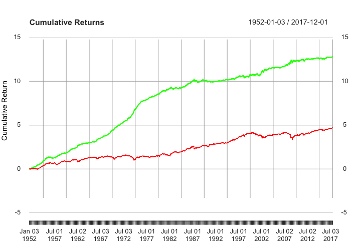

# Time Series Trading Strategy Implementation

**An implementation of a Time Series Trading Strategy for both the Stock and Forex Markets**

---

**Theoretical Topics:** *Time Series, Time Series Models, Forex, *

**Tools / Technologies:** *R, Quantmod, TimeSeries, Rugarch*

---

### Technical Explanation:

1. ARIMA Modelling Example

    *What is Autoregressive Integrated Moving Average (ARIMA)?*

    > It is a statistical analysis model that uses time series data to either better understand the data set or to predict future trends, it is autoregressive because it uses past values to predict future values

    The primary advantage of the ARIMA model is that we are able to convert non-stationary processes (Ex. Random Walk) into stationary processes (Ex. White Noise)

    In this example we are exploring ARIMA, how it works, and how to measure it's performance

    *Setup*

    ARIMA has three variables p, d, and q
    - p -> Order of the Autoregressive Model (AR)
    - d -> The number of nonseasonal differences needed for stationarity (typically 0)
    - q -> Order of the Moving Average Model (MA)

    These varibales can be found by performing a search (similar to grid search). We use a metric called AIC which helps measure of how well the model is able to make accurate prediction

    We then test the ARIMA model using the Ljung-Box Test which is a statistical test of whether any of a group of autocorrelations of a time series are different then zero

    {\displaystyle Q=n(n+2)\sum _{k=1}^{h}{\frac {{\hat {\rho }}_{k}^{2}}{n-k}}}

    `Q = n(n+2) Σ[h, k=1] (δ[2, k]/(n-k))`

    This test returns a p-value which is important:
    - p-value < 0.05 --> There is some autocorrelation which is bad
    - p-value > 0.05 --> Not enough evidence to reject H0 hypothesis, possibly no autocorrelation which is good

    In this case the p-value is 0.08527 which is good

    *Plot*

    This forecasts the log daily returns for 50 future day. This is the essence of Time Series, making future predictions from past data points.

    

2. GARCH Modelling Example

    *What is Generalized Autoregressive Heteroskedastic Model (GARCH)?*

    > The Generalized Autoregressive Heteroskedastic Model helps predict volatility of returns on financial assets

    The primary advantage of the GARCH model is that it is best used for time series data where the variance of the error term in autocorrelated following a autoregressive moving average process

    In this example we are exploring GARCH and how it works

    *Setup*

    The setup for this is the exact same as the ARIMA model except at the very end we overlay the GARCH model to explain the volatility clustering and autocorrelation

    Essentially it helps us get rid of autocorrelation, we can see this within the plots below. A few points to keep in mind within autocorrelation plots:
    - We want a minimal amount of vertical lines above the blue dashed line
    - The blue dashed line represents a 95% confidence rate that there is no autocorrelation

    *Plot*

    Here is the Autocorrelation plot for just ARIMA

    

    Here is the Autocorrelation plot for ARIMA applying the GARCH model

    

3. Stock Market Strategy Implementation -- [StockMarketStrategy.py](https://github.com/harshp30/TimeSeriesTradingStrategyImplementation/blob/main/src/StockMarketStrategy.R)

     *What are the steps to implement the Stock Market Strategy?*

    > It will use Time series analysis, with a combition of ARIMA and GARCH to get explain autocorrelation and volatility clustering

    The steps will be as follows:
    
    1. Technical Analysis: Look at historical data to make predictions in the future
    2. Combine ARIMA and GARCH: Helps explain autocorrelation and volatility clustering
    3. Define a rolling window of length H, we then use the model to make a prediction for each H observation, and predict the next days log daily returns

    *Setup*

    We follow the steps just as shown above.

    First we extract the data and the variables such as the rolling window

    ```
    gspc <- read.csv(file="data/SP500.csv", header = T)
    dates <- as.Date(as.character(gspc[, 1],format="%d/%m/%Y"))
    returns <- diff(log(gspc$Adj.Close))

    window.length <- 100
    forecasts.length <- length(returns) - window.length
    forecasts <- vector(mode="numeric", length=forecasts.length) 
    directions <- vector(mode="numeric", length=forecasts.length) 
    ```

    Then we iterate through each forecast.length and optimize the ARIMA model

    ```
    for (i in 0:forecasts.length) 
        current.aic <- AIC(model)
        if (current.aic < final.aic) {
            final.aic <- current.aic
            final.order <- c(p,0,q)
            final.arima <- arima(roll.returns, order = final.order)
        }
    ``` 

    We then apply the GARCH model and create the forecast lines to compare with a long term hold vs the Trading Strategy

    *Plot*

    Here is the outcome of the trading strategy
    
    Green is our model

    Red represents a long term hold

    

4. Forex Market Strategy Implementation -- [ForexStrategy.py](https://github.com/harshp30/TimeSeriesTradingStrategyImplementation/blob/main/src/ForexStrategy.R)

    *What is FOREX?*

    > FOREX also known as foreign exchange market is used for exchanging currencies. So for example to convert CAD dollars to EUR Euros FOREX is used

    It can also be thought of like a trading post for money
    
    *What are the steps to implement the FOREX Strategy?*

    > It will use Time series analysis, with a combition of ARIMA and GARCH to get explain autocorrelation and volatility clustering

    The steps will be as follows:
    
    1. Technical Analysis: Look at historical data to make predictions in the future
    2. Combine ARIMA and GARCH: Helps explain autocorrelation and volatility clustering
    3. Define a rolling window of length H, we then use the model to make a prediction for each H observation, and predict the next days log daily returns

    *Setup*

    The setup is the exact same as the Stock Market Implementation, only difference is the initial data which in this case is...

    ```
    eurusd <- read.csv(file="data/EURUSD.csv")
    ```

    *Plot*

    Here is the outcome of the trading strategy
    
    Green is our model

    Red represents a long term hold

    

---

### Next Steps:

- Trying differnt rolling window lengths to see if performance improves

---

### Additional Notes:
- Data is provided by [Holczer Balazs](https://www.udemy.com/course/quantitative-finance-algorithmic-trading-ii-time-series/) 
- The code blocks above are not complete, to view full code go to the arc files